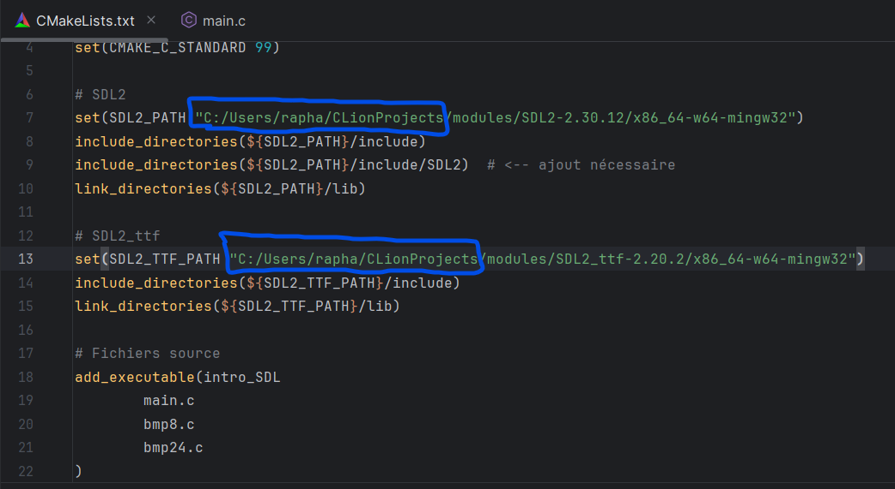
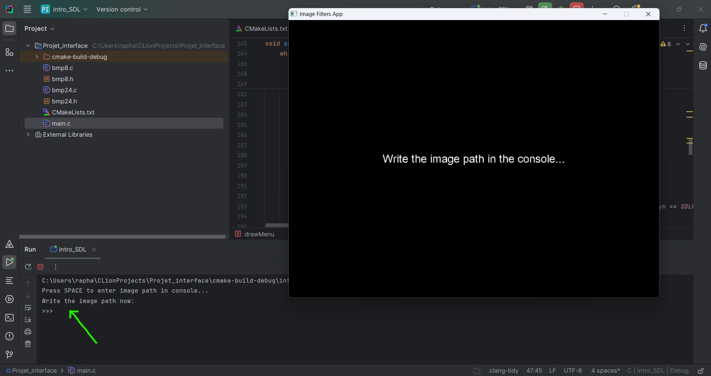

# P1 - TI202 : 🖼️ Image processing in C

## Description
This project is a full-featured BMP image processing application written in C.  
It supports **8-bit grayscale** and **24-bit RGB uncompressed BMP** files.  
Two interfaces are available:
- A **text-based console interface** for loading, modifying, and saving BMP images.
### Bonus
- A **graphical SDL2 interface** with keyboard navigation, image rendering, and interactive filtering.
  Download with this link:
```bash
  https://mega.nz/folder/HAVmgKKQ#P5vscf7kaJ6bDe70qVwpow
  ```
---
## Project Members

- Bramli Youssef
- Gastaldo Raphaël

---

## Source Files

- `main.c` — Terminal user interface
- `bmp8.c` / `bmp8.h` — 8-bit BMP image handling and filters
- `bmp24.c` / `bmp24.h` — 24-bit BMP image handling and filters
- `interface.c` — SDL2 graphical version
- `CMakeLists.txt` — Build configuration for Clion / SDL2

---

## Implemented Data Structures

- `t_bmp8` — Structure for 8-bit BMP images (header, palette, data)
- `t_bmp24` — Structure for 24-bit BMP images (width, height, bit depth, pixel matrix)
- `t_pixel` — Structure representing an RGB pixel
- LUTs, histograms, cumulative distribution functions (CDF), convolution buffers

---

## Implemented Features
### 8-bit Grayscale BMP Images

- Load uncompressed 8-bit BMP files
- Display image metadata (width, height, size, bit depth)
- Apply filters:
  -  Negative
  -  Brightness adjustment
  -  Threshold (black and white)
  -  Box Blur
  -  Gaussian Blur
  -  Outline detection
  -  Emboss effect
  -  Sharpen
  -  Histogram Equalization (with debug output for LUT/CDF)

### 24-bit RGB BMP Images

- Load uncompressed 24-bit BMP files
- Display image metadata (width, height, bit depth)
- Apply filters:
  -  Negative
  -  Grayscale conversion
  -  Brightness adjustment
  -  Box Blur
  -  Gaussian Blur
  -  Outline detection
  -  Emboss effect
  -  Sharpen
  -  Histogram Equalization (separately on R, G, B channels)

### Bonus: SDL2 Graphical Interface

- Navigate using the keyboard (↑ ↓ Enter)
- SDL_ttf-based text interface
- Render images on screen (before / after filters)
- Image displayed in 800×600 window (scaled with margins)
- Prompt to enter image path via console
- Filters applied and image updated in real-time
- Pause and wait for Enter after each image render
- Compatible with SDL2 v2.30 and SDL_ttf v2.20

---

## Missing Features

- None: All requested functionalities have been implemented

---

## Known Issues

- If the image is larger than the SDL2 window, slight blurring may occur due to scaling
- Image paths are typed in the **console**, not the SDL window
- Save function or both bmp images types (corrupted images/black images everytime we save)
- Gestion of RGB in the part 3 (can see the folder "test" to see each issues with test-images )
- Writing the path in the console for the Interface version too (not in the window is much complex)
- If the image is larger than the SDL2 window, slight blurring may occur due to scaling

---
## Compilation & Execution Instructions

### Console Version

```bash
gcc main.c bmp8.c bmp24.c -o bmpfilter -lm
./bmpfilter
```

### SDL2 Version

- Open the `Projet_interface` folder
- Ensure SDL2 and SDL2_ttf are present in the `modules` folder

```bash
  Bramli, Gastaldo INT4 Project/
├──   modules/                
│   ├── /SDL2_ttf-2.20.2
│   ├── /SDL2-2.30.12
├── Projet_interface
│   ├── /cmake-build-debug
│   ├── /bmp8.c
│   ├── /bmp8.h
│   ├── /bmp24.c
│   ├── /bmp24.h
│   ├── /CmakeLists.txt
│   ├── /main.c
└──
```
## In `CMakeLists.txt` :

**Important to don't touch the configuration because they are the new library (SDL2)**
## **BUT MODIFY THIS UNDERLINE PATH BY YOUR PATH**

# not necessary to change the not underline path
## Notes

- Make sure `SDL_ttf` is installed and `SDL2_ttf.dll` is in the executable directory:  
  (Verify but those file must be present in the `CMakelist.txt` folder)
- The font used is: `C:/Windows/Fonts/arial.ttf` (can be changed)
- File paths must be entered via **console input**, not SDL window


  
*Example*

---

## Répartition des tâches

**Bramli Youssef**
- Part 1 and text readme
- Help for the part 3

**Raphael Gastaldo**:
- The whole SDL2 interface
- Part 2 and 3


